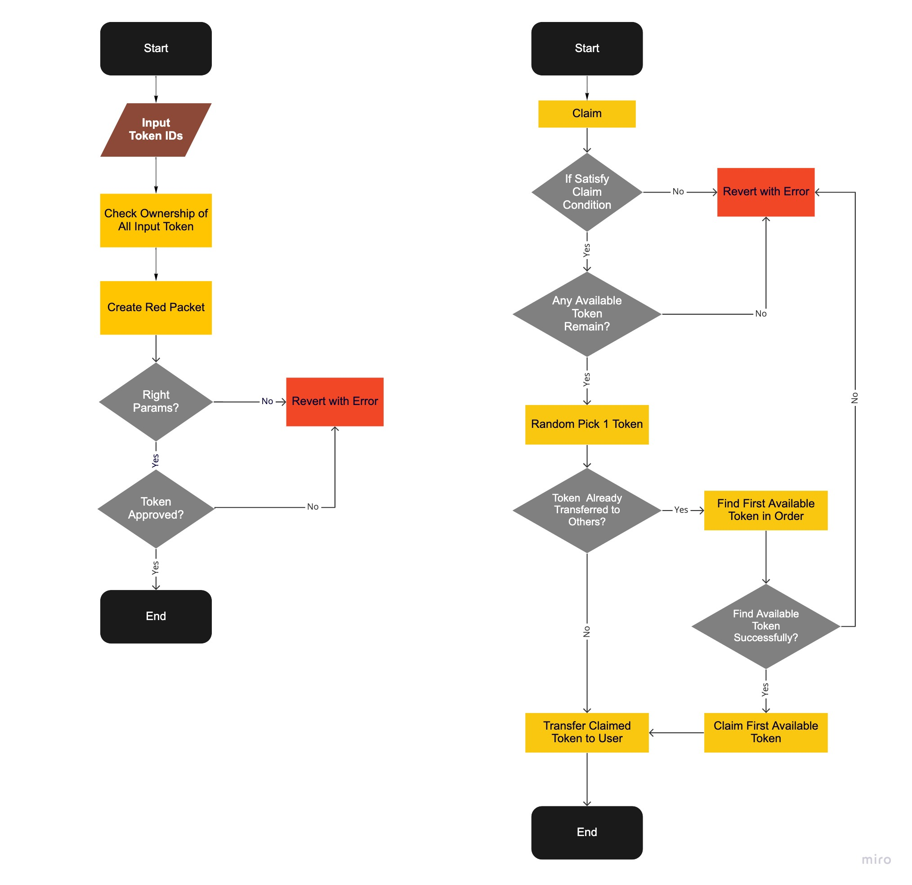

# RedPacket Smart Contract 
## Content Overview
- [Function Briefing in RedPacket_erc721](#function-briefing-in-redpacket_erc721)
  - [General Description](#general-description)
  - [create_red_packet](#create_red_packet)
  - [claim](#claim)
  - [check_ownership](#check_ownership)
  - [check_availability](#check_availability)
  - [check_claimed_id](#check_claimed_id)
  - [check_erc721_remain_ids](#check_erc721_remain_ids)
- [Workflow in RedPacket_erc721](#workflow-in-redpacket_erc721)
- [Function Briefing in Fungible Token Red Packet](#function-briefing-in-fungible-token-red-packet)
  - [General Description for Red Packet](#general-description-for-red-packet)
  - [create_red_packet](#create-red-packet)
  - [claim](#claim-packet)
  - [check_availability](#check-red-packet-availability)
  - [refund](#refund)

## Function Briefing in RedPacket_erc721
### General Description
Generally, users can specify a list of ERC721 token ID to create an ERC721 red packet with RedPacket_ERC721. Then, users are able to randomly claim one NFT from the red packet.

### create_red_packet
Specify a list of token ID and create a red packet with expiration time.

```solidity
  function create_red_packet(
    address _public_key,
    uint64 _duration,
    bytes32 _seed,
    string memory _message,
    string memory _name,
    address _token_addr,
    uint256[] memory _erc721_token_ids
  )
    external
  {}
```

- Parameters:
	- `_public_key`: Generated at Front-end. Used for verification in claim period. 
	- `_duration`: Red packet valid duration. (Unit: s) Used to calculate red packet expire time.
	- `_seed`: Used to generate packet_id.
	- `_message`: Additional message in this red packet.
	- `_name`: Name of this red packet.
	- `_token_addr`: NFT contract address
	- `_erc721_token_ids`: A list of token IDs to be packed in this red packet.

- Requirements:
  - At least one ID in `_erc721_token_ids`
  - At most 256 token IDs in `_erc721_token_ids`:
    - Since we used a uint256 to maintain the availability status of all input tokens
  - Users need to `setApprovalForAll()` in advance

- Returns:
  - N/A

- Events:

  ```solidity
    event CreationSuccess(
      uint256 total_tokens,
      bytes32 indexed id,
      string name,
      string message,
      address indexed creator,
      uint256 creation_time,
      address token_address,
      uint256 packet_number,
      uint256 duration,
      uin256[] token_ids
    );
  ```

### claim
Users can claim an ERC721 token from the red packet.

```solidity
  function claim(
    bytes32 pkt_id,
    bytes memory signedMsg,
    address payable recipient
  )
    external
    returns(
      uint256 claimed
    )
  {}
```

- Parameters:
  - `pkt_id`: Use id to specify the target red packet.
  - `signedMsg`: Result of signing the `msg.sender` with a private key (corresponding to the public key passed in `create_red_packet`)
  - `recipient`: NFT recipient.
  
- Requirements:
  - This red packet is not expired.
  - There is still available NFT remained.
  - The user hasn't claimed before.
  - The `signedMsg` verification passed .

- Returns:
  - `claimed`: Claimed NFT ID

- Events:

  ```solidity
    event ClaimSuccess(
      bytes32 indexed id,
      address indexed claimer,
      uint256 claimed_token_id,
      address token_address
    );
  ```

### check_ownership
Used to check whether all input tokens belong to `msg.sender`.

```solidity
  function check_ownership(
    uint256[] memory erc721_token_ids_list,
    address token_addr
  )
    external
    view
    returns(
      bool is_your_token
    )
  {}
```

- Parameters:
  - `erc721_token_ids_list`: Token IDs to be packed in red packet.
  - `token_addr`: NFT contract address
  
- Requirements:
  - N/A
  
- Returns:
  - `is_your_token`: If all input tokens belong to you
  
- Events:
  - N/A

### check_availability
Check red packet info.

```solidity
  function check_availability(
    bytes32 pkt_id
  )
    external
    view
    returns(
      address token_address,
      uint16 balance,
      uint256 total_pkts,
      bool expired,
      uint256 claimed_id,
      uint256 bit_status
    )
  {}
```

- Parameters:
  - `pkt_id`: Use id to specify the target red packet.
  
- Requirements:
  - N/A
  
- Returns:
  - `token_address`: NFT contract address.
  - `balance`: Amount of remained token.
  - `total_pkts`: Total number of packets.
  - `expired`: If this red packet is expired.
  - `claimed_id`: Claimed token ID of the `msg.sender`.
  - `bit_status`: A uint256 records the current token availability status of this red packet.
  
- Events:
  - N/A

### check_claimed_id
Get the claimed token ID for `msg.sender`.

```solidity
  function check_claimed_id(
    bytes32 id
  )
    external
    view
    returns(
      uint256 claimed_token_id
    )
  {}
```

- Parameters:
  - `id`: Use id to specify the target red packet.

- Requirements:
  - N/A

- Returns:
  - `claimed_token_id`: Claimed token ID of this `msg.sender`.

- Events:
  - N/A

### check_erc721_remain_ids
Get the current availability status of all tokens in a red packet.

```solidity
  function check_erc721_remain_ids(
    bytes32 id
  )
    external
    view
    returns(
      uint256 bit_status,
      uint256[] memory erc721_token_ids
    )
  {}
```

- Parameters:
  - `id`: Use id to specify the target red packet.

- Requirements:
  - N/A

- Returns:
  - `bit_status`: A uint256 records the current token availability status of this red packet.
  - `erc721_token_ids`: Token IDs packed in this red packet when `create_red_packet`.

- Events:
  - N/A

## Workflow in RedPacket_erc721


## Function Briefing in Fungible Token Red Packet
### General Description for Red Packet
Generally, users can specify a list of ERC721 token ID to create an ERC721 red packet with RedPacket_ERC721. Then, users are able to randomly claim one NFT from the red packet.

### create red packet 
Specify a list of token ID and create a red packet with expiration time.

```solidity
  function create_red_packet(
    address _public_key,
    uint _number,
    bool _ifrandom,
    uint _duration,
    bytes32 _seed,
    string memory _message,
    string memory _name,
    uint _token_type,
    address _token_addr,
    uint _total_tokens
  )
    public
    payable
  {}
```

- Parameters:
  - `_public_key`: Generated at Front-end. Used for verification in claim period. 
  - `_number`: The amount of packets in red packet.
  - `_ifrandom`: The claim method for this red packet. If true, claimer will claim random number of token. Otherwise, claimer will claim average number of token.
  - `_duration`: The valid period time for this red packet. This can determine the expire time of a red packet.
  - `_seed`: Used to generate packet_id.
  - `_message`: Additional message in this red packet.
  - `_name`: Name of this red packet.
  - `_token_type`: 0 - ETH  1 - ERC20
  - `_token_addr`: token contract address.
  - `_total_tokens`; Amount of token to put in red packet.

- Requirements:
  - Total token amount should be greater than packets amount.
  - Packets number should be in the range: 1-255 (including 1 and 255).
  - Token type should be 0 or 1.
  - If user creates an ETH red packet, `msg.value` should be greater than the stated token amount. If user creates an ERC20 red packet, user should approve at least the stated amount of token to our red packet contract.

- Returns:
  - N/A

- Events:

  ```solidity
    event CreationSuccess(
      uint total,
      bytes32 id,
      string name,
      string message,
      address creator,
      uint creation_time,
      address token_address,
      uint number,
      bool ifrandom,
      uint duration
    );
  ```

### claim packet
Users can claim random(or average) amount of token from the red packet.

```solidity
  function claim(
    bytes32 id,
		bytes memory signedMsg,
		address payable recipient
  )
    public
    returns(
      uint claimed
    )
  {}
```

- Parameters:
  - `pkt_id`: Use id to specify the target red packet.
  - `signedMsg`: Result of signing the `msg.sender` with a private key (corresponding to the public key passed in `create_red_packet`)
  - `recipient`: Token recipient.

- Requirements:
  - This red packet is not expired.
  - There is still available packet remained.
  - The user hasn't claimed before.
  - The `signedMsg` verification passed .

- Returns:
  - `claimed`: Claimed NFT ID

- Events:

  ```solidity
    event ClaimSuccess(
      bytes32 id,
      address claimer,
      uint claimed_value,
      address token_address
    );
  ```

### check red packet availability
Check red packet info.

```solidity
  function check_availability(bytes32 id) external view returns(
    address token_address,
    uint balance,
    uint total,
    uint claimed,
    bool expired,
    uint256 claimed_amount
  )
  {}
```

- Parameters:
  - `id`: Use id to specify the target red packet.
  
- Requirements:
  - N/A
  
- Returns:
  - `token_address`: Token contract address.
  - `balance`: Amount of remained token.
  - `total`: Total number of packets.
  - `claimed`: Claimed number of red packets.
  - `expired`: If this red packet is expired.
  - `claimed_amount`: The claimed amount of `msg.sender`
  
- Events:
  - N/A

### refund
After the redpacket expired, the redpacket creator is able to withdraw the remaining token.

```solidity
  function refund(bytes32 id) public {}
```
- Parameters:
  - `id`: Use id to specify the target red packet.
  
- Requirements:
  - The `msg.sender` should be red packet creator.
  - The red packet is expired.
  - There is token remained in the red packet.
  
- Returns:
  - N/A

- Events:

  ```solidity
    event RefundSuccess(
      bytes32 id,
      address token_address,
      uint remaining_balance
    );
  ```
